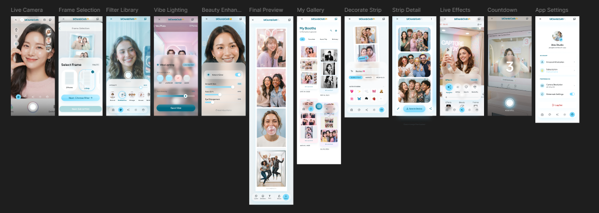

# 📸 Photobooth App — Tugas Besar Mobile Programming (Client-Server)

Aplikasi mobile **Photobooth** berbasis **Flutter (client)** dan **REST API Node.js + SQLite (server)**, dibuat untuk memenuhi tugas besar mata kuliah **Pemrograman Perangkat Bergerak (Client-Server)**. UI/UX aplikasi mengikuti rancangan desain berikut:



---

## 1. Ringkasan Aplikasi

Photobooth App memungkinkan pengguna untuk:
1. Mengambil beberapa foto berturut-turut lewat kamera device (dengan hitung mundur/*countdown*).
2. Memilih **frame**, **filter warna**, **vibe lighting**, dan **beauty enhancement**.
3. Melihat **Final Preview** hasil strip foto sebelum disimpan.
4. Menyimpan strip ke **My Gallery** (tersimpan permanen di backend).
5. Membuka kembali strip di **Strip Detail**, mengedit judul/favorit, atau menambah **dekorasi** (stiker/emoji/teks) lewat **Decorate Strip**.
6. Mengatur preferensi lewat **App Settings** (resolusi kamera, watermark, durasi countdown, live effects).

Aplikasi ini **tidak memakai fitur login/register** — user langsung masuk ke aplikasi tanpa autentikasi, sehingga alur pemakaian jadi lebih singkat untuk kebutuhan demo/tugas besar. Semua data (strip foto, foto individual, frame, filter, dekorasi, dan pengaturan) tetap disimpan di server lewat REST API — bukan hanya di local storage — sehingga tetap memenuhi ketentuan **arsitektur client-server**. Secara teknis, backend tetap punya 1 baris "default user" di tabel `users` supaya relasi antar tabel (`photo_sessions.user_id`, `app_settings.user_id`) tetap terjaga tanpa perlu proses login di sisi aplikasi.

---

## 2. Teknologi yang Digunakan

| Bagian     | Teknologi                                                                 |
|------------|-----------------------------------------------------------------------------|
| **Client (mobile)** | Flutter (Dart), package: `http`, `camera`, `image_picker`, `shared_preferences`, `intl` |
| **Server (API)**    | Node.js + Express.js                                                     |
| **Database**         | SQLite (`better-sqlite3`) — file-based, tanpa perlu instalasi DB server terpisah |
| **Upload File**        | `multer` (upload foto/gambar ke server, disajikan lewat static folder `/uploads`) |
| **Version Control**    | Git                                                                       |

API dapat dijalankan **secara lokal** (`localhost`/jaringan WiFi kampus) maupun **di-deploy ke internet** (Railway/Render/VPS) — cukup ubah `baseUrl` di `mobile/lib/utils/constants.dart`.

---

## 3. Arsitektur & Struktur Folder

```
photobooth-app/
├── backend/            # REST API (Node.js + Express + SQLite)
│   ├── src/
│   │   ├── config/      # koneksi DB & schema
│   │   ├── models/       # query layer (7 tabel)
│   │   ├── controllers/  # logic tiap resource
│   │   ├── middleware/    # upload (multer)
│   │   └── routes/        # endpoint REST
│   ├── database/          # seeder + file SQLite (dibuat otomatis)
│   └── README.md           # panduan setup & daftar endpoint backend
├── mobile/              # Aplikasi Flutter
│   ├── lib/
│   │   ├── models/       # representasi 7 entitas backend
│   │   ├── services/      # pemanggil REST API
│   │   ├── screens/        # 1 file per layar UI
│   │   ├── widgets/         # komponen reusable
│   │   └── utils/            # constants, theme, token storage
│   └── README.md              # panduan setup & pemetaan layar Flutter
├── docs/
│   ├── ui-ux-design-reference.png
│   └── screenshots/          # taruh screenshot hasil running app di sini untuk presentasi
├── .gitignore
└── README.md            # (file ini)
```

---

## 4. Struktur Database (7 Tabel dengan Relasi)

Database **tidak hanya 1 tabel** — terdapat 7 tabel yang saling berelasi lewat *foreign key*:

```
users            (1) ────< (N) photo_sessions
users            (1) ────( 1) app_settings
frames           (1) ────< (N) photo_sessions
photo_sessions   (1) ────< (N) photos
photo_sessions   (1) ────< (N) decorations
filters          (1) ────< (N) photos
```

### Rincian Kolom

**`users`** — profil pengguna. *Catatan: aplikasi tidak punya fitur login/register, jadi tabel ini hanya berisi 1 baris "default user" (id=1) yang otomatis dibuat oleh seeder — fungsinya menjaga relasi FK ke `photo_sessions` dan `app_settings` tetap valid.*
| Kolom       | Tipe    | Keterangan            |
|-------------|---------|--------------------------|
| id          | INTEGER | Primary Key              |
| name        | TEXT    | Nama tampilan (bisa diubah di App Settings) |
| email       | TEXT    | Unik (tidak dipakai untuk login)      |
| password    | TEXT    | Tidak dipakai (kolom sisa skema, diisi `-`) |
| role        | TEXT    | Default `user`           |
| avatar_path | TEXT    | Path foto profil         |

**`frames`** — master data bingkai/layout strip
| Kolom          | Tipe    | Keterangan                    |
|----------------|---------|----------------------------------|
| id             | INTEGER | Primary Key                     |
| name           | TEXT    | Nama frame                      |
| layout_type    | TEXT    | `2-cut` / `4-cut` / `6-cut`      |
| thumbnail_path | TEXT    | Path gambar thumbnail            |
| is_active      | INTEGER | Soft-delete flag                |

**`filters`** — master data filter (color / vibe lighting / beauty)
| Kolom              | Tipe    | Keterangan                              |
|--------------------|---------|--------------------------------------------|
| id                 | INTEGER | Primary Key                                |
| name               | TEXT    | Nama filter                                |
| type               | TEXT    | `color` / `vibe_lighting` / `beauty`       |
| thumbnail_path     | TEXT    | Path gambar thumbnail                      |
| intensity_default  | REAL    | Intensitas default (0–1)                   |

**`photo_sessions`** — satu strip/sesi photobooth (ditampilkan di My Gallery)
| Kolom       | Tipe    | Keterangan                              |
|-------------|---------|--------------------------------------------|
| id          | INTEGER | Primary Key                                |
| user_id     | INTEGER | FK → `users.id`                            |
| frame_id    | INTEGER | FK → `frames.id` (nullable)                |
| title       | TEXT    | Judul strip                                |
| layout_type | TEXT    | Disalin dari frame saat dibuat             |
| is_favorite | INTEGER | Tandai favorit                             |

**`photos`** — foto individual di dalam sebuah strip
| Kolom            | Tipe    | Keterangan                       |
|------------------|---------|--------------------------------------|
| id               | INTEGER | Primary Key                        |
| session_id       | INTEGER | FK → `photo_sessions.id`           |
| filter_id        | INTEGER | FK → `filters.id` (nullable)        |
| image_path       | TEXT    | Path file hasil upload               |
| order_index      | INTEGER | Urutan tampil dalam strip            |
| beauty_smooth    | REAL    | Nilai smoothing (0–1)                |
| beauty_brighten  | REAL    | Nilai brighten (0–1)                 |

**`decorations`** — stiker/teks/emoji yang ditambahkan di Decorate Strip
| Kolom      | Tipe    | Keterangan                          |
|------------|---------|-----------------------------------------|
| id         | INTEGER | Primary Key                            |
| session_id | INTEGER | FK → `photo_sessions.id`                |
| type       | TEXT    | `sticker` / `text` / `emoji`             |
| content    | TEXT    | Isi teks / karakter emoji / nama aset    |
| pos_x, pos_y | REAL  | Posisi di kanvas strip                   |
| scale, rotation | REAL | Transformasi tampilan                 |

**`app_settings`** — preferensi per user (App Settings screen)
| Kolom                 | Tipe    | Keterangan                     |
|-----------------------|---------|------------------------------------|
| id                    | INTEGER | Primary Key                       |
| user_id               | INTEGER | FK → `users.id`, unik (1:1)        |
| camera_resolution     | TEXT    | `720p` / `1080p` / `4K`             |
| watermark_enabled     | INTEGER | 0/1                                |
| countdown_duration    | INTEGER | Detik hitung mundur                |
| live_effects_enabled  | INTEGER | 0/1                                |

Lihat `backend/src/config/database.js` untuk DDL (`CREATE TABLE`) lengkapnya.

---

## 5. Cara Menjalankan

### Backend
```bash
cd backend
npm install
cp .env.example .env
npm run seed
npm start
# API berjalan di http://localhost:3000
```
Detail endpoint lengkap ada di [`backend/README.md`](backend/README.md).

### Mobile (Flutter)
```bash
cd mobile
flutter create . --project-name photobooth_app --org com.example
flutter pub get
flutter run
```
Panduan permission kamera & konfigurasi base URL ada di [`mobile/README.md`](mobile/README.md).

> ⚠️ Folder `android/` dan `ios/` belum digenerate di dalam ZIP ini karena proses pembuatan project dilakukan di lingkungan tanpa Flutter SDK. Jalankan `flutter create .` seperti di atas — ini **tidak** akan menimpa kode Dart yang sudah ada di `lib/`.

---

## 6. Fitur CRUD yang Diimplementasikan

| Entitas          | Create | Read | Update | Delete |
|-------------------|:------:|:----:|:------:|:------:|
| Profile (default user) | – (otomatis via seeder) | ✅ (`/api/profile`) | ✅ (nama/avatar) | – |
| Frames            | ✅ | ✅ | ✅ | ✅ (soft delete) |
| Filters           | ✅ | ✅ | ✅ | ✅ |
| Photo Sessions (strip) | ✅ (Final Preview) | ✅ (My Gallery, Strip Detail) | ✅ (judul, favorit, frame) | ✅ |
| Photos            | ✅ | ✅ (nested di session) | ✅ (filter, urutan, beauty) | ✅ |
| Decorations       | ✅ (Decorate Strip) | ✅ (nested di session) | ✅ (posisi, isi) | ✅ |
| App Settings      | ✅ (auto saat pertama akses) | ✅ | ✅ | – |

---

## 7. Persiapan Presentasi (P2 UAS)

Checklist yang perlu disiapkan sebelum presentasi (lihat ketentuan tugas besar):

- [ ] **Screenshot aplikasi berjalan** — simpan di `docs/screenshots/` (live camera, my gallery, strip detail, decorate strip, settings, dll).
- [ ] **Kode program** — sudah lengkap di `backend/` dan `mobile/lib/`, tinggal ditunjukkan/dijelaskan per bagian saat presentasi.
- [ ] **Penjelasan ringkas app** — gunakan bagian "1. Ringkasan Aplikasi" di README ini sebagai bahan slide.
- [ ] **Teknologi yang digunakan** — gunakan tabel di bagian "2. Teknologi yang Digunakan".
- [ ] **Struktur tabel database** — gunakan bagian "4. Struktur Database" (bisa langsung screenshot tabel di atas atau gambar ulang sebagai diagram ERD di slide).
- [ ] **Demo alur aplikasi** — jalankan backend (`npm start`) lalu jalankan app Flutter, demokan alur: buka app (langsung tanpa login) → Live Camera → pilih Frame/Filter/Vibe/Beauty → Final Preview → simpan → My Gallery → Strip Detail → Decorate Strip → App Settings.

---

## 8. Git

Project ini sudah diinisialisasi sebagai repository Git (lihat riwayat commit dengan `git log`) sehingga riwayat perkembangan kode (setup backend, model & routes, aplikasi Flutter, dokumentasi) dapat ditunjukkan saat presentasi. Untuk push ke GitHub/GitLab pribadi:

```bash
git remote add origin <url-repo-kamu>
git branch -M main
git push -u origin main
```

---

## 9. Penulis

**Naufal** — Mahasiswa Teknik Informatika, semester 6.
Tugas Besar mata kuliah Pemrograman Perangkat Bergerak (Client-Server).
